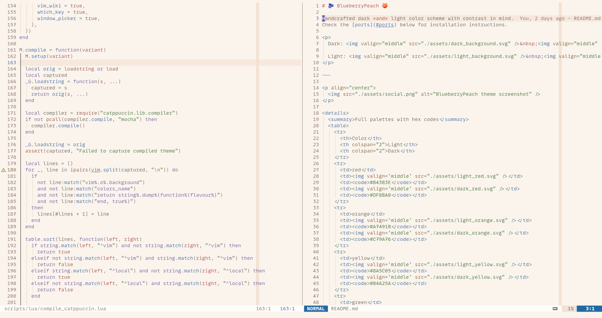
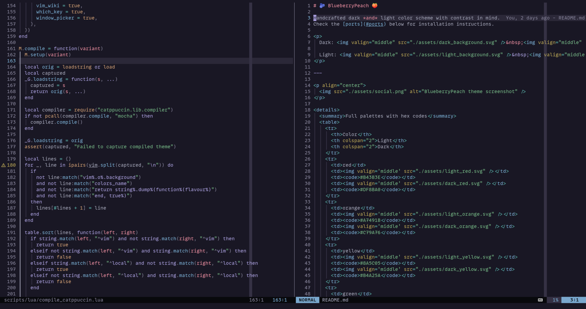

# 🫐 Blueberry Peach NeoVim 🍑

Handcrafted dark _and_ light neovim color scheme with legibility and consistency in mind.

> [!IMPORTANT]
> For palettes, other ports, contribution info, etc. see [blueberry-peach on GitHub](https://github.com/schemar/blueberry-peach).
>
> The same goes for issues, pull-requests, etc. See [Blueberry Peach's CONTRIBUTING.md](https://github.com/schemar/blueberry-peach/blob/main/CONTRIBUTING.md).

Based on, but does not require [catppuccin/nvim](https://github.com/catppuccin/nvim).
Supports almost all integrations that catppuccin includes.

<table>
  <tr>
    <td>
      <a href="./screenshots/light.png">
        
      </a>
    </td>
    <td>
      <a href="./screenshots/dark.png">
        
      </a>
    </td>
  </tr>
</table>

## Installation

Install the plugin like any other plugin with your plugin manager of choice.

Example with [lazy](https://github.com/folke/lazy.nvim):

```lua
{
  "schemar/blueberry-peach.nvim",
  lazy = false, -- make sure we load this during startup if it is your main colorscheme
  priority = 1000, -- make sure to load this before all the other start plugins
  config = function()
    -- load the colorscheme here
    vim.cmd([[colorscheme blueberry-peach]])
  end,
},
```

Example with [vim.pack](https://neovim.io/doc/user/pack/#vim.pack):

```lua
vim.pack.add({
  'https://github.com/schemar/blueberry-peach.nvim',
})
```

## Usage

1. Set the colorscheme in your `init.lua` (if you haven't done so already in your package manager):
   ```lua
   vim.cmd([[colorscheme blueberry-peach]])
   ```
2. (Optional) Set the colorscheme for [lualine](https://github.com/nvim-lualine/lualine.nvim):
   ```lua
   require('lualine').setup({
     options = {
        theme = 'blueberry-peach'
     }
   })
   ```

> [!NOTE]
>
> The theme should automatically select the light or dark variant based on your terminal setup.
>
> If you want to set the variant explicitly, use `:set background=dark` or `:set background=light` or set it from your `init.lua`.

## Standing on the shoulders of giants

The color schemes are based on and/or utilize code from the following projects (see [LICENSES](./LICENSES)):

- [Catppuccin](https://github.com/catppuccin/catppuccin)
- [Rosé Pine](https://github.com/rose-pine/rose-pine-theme)
